# ML-CFD Automated Pipeline: Project Journal

## Project Vision & Inception
**The Goal:** To build an automated AI-engineering pipeline for Fluid Dynamics (ML-CFD). Instead of manually writing machine learning scripts for specific fluid mechanics problems, the objective is to engineer a system that ingests raw academic research (PDFs, transcripts, flow problem statements) and uses AI to autonomously extract physical equations, generate the corresponding PyTorch/TensorFlow code, and pass that code through automated physics tests (e.g., mass conservation, Lyapunov exponents, power spectral densities) before deployment.

---

## Phase 1: Ingestion & Knowledge Extraction

### 1. The PDF Extraction Bottleneck
* **The Pitfall:** We realized that directly feeding academic PDFs to an LLM for code generation is a recipe for failure. Standard PDF text extractors scramble two-column layouts and completely destroy complex Navier-Stokes equations and loss formulations. If the AI reads broken math, it writes broken code.
* **The Resolution:** We executed a "PDF Ingestion Scout" to evaluate math-aware OCR tools. We ranked candidates based on academic math fidelity and ecosystem fit, ultimately selecting **Marker** to act as a translator, converting dense PDFs into Markdown.

### 2. The LLM Formatting Hallucination
* **The Pitfall:** While Marker successfully extracted the text, the raw output was littered with HTML tags (like ``, ``), broken KaTeX page anchors, and numbered equations trapped in broken Markdown tables. We initially attempted to use GitHub Copilot to manually clean up these artifacts using prompt instructions. The LLM suffered from "attention fatigue" over the large document, dropping characters and failing to perform exhaustive, reliable syntax substitution.
* **The Resolution:** We abandoned the brittle LLM-based formatting approach and engineered a deterministic Python regex script (`tools/normalize_markdown.py`). This script surgically targets known artifacts and converts them into pristine LaTeX blocks, ensuring perfectly clean data enters the knowledge base.

### 3. The Automation "Cheat"
* **The Pitfall:** During the end-to-end mapping of Stage 1, we noticed a critical architectural flaw. While the extraction and normalization steps were automated via scripts, the final step—synthesizing the academic paper into a strict, code-ready blueprint—relied on manual `@workspace` prompts in Copilot Chat. This manual intervention completely broke the concept of a seamless batch pipeline.
* **The Resolution:** We closed the loop on Stage 1 by writing `tools/synthesize_blueprint.py`. By shifting the blueprint synthesis to a programmatic LLM API call, we eliminated human intervention, allowing the batch script to process an entire folder of PDFs into actionable architectural blueprints autonomously.

### 4. The Folder Rename (Pathing Hygiene)
* **The Change:** The nested paper directory was renamed from `CFD_Technical_Papers/` (which collided with the root workspace name `CFD_Technical_Papers/`) to `pdf_repository/`. The `download_papers.py` `OUTPUT_DIR` and `tools/batch_process.sh` `PDF_DIR` were updated to match.
* **The Reason:** Recorded here to prevent future pathing confusion — any script or doc referencing the old `CFD_Technical_Papers/<pdf>` path is stale and must point at `pdf_repository/`.

### 5. Feasibility Study & Data Pipeline Audit
* **The Strategic Pivot:** Before blindly expanding the ingestion pipeline to all 48 papers in the repository, we mandated a "vertical slice" Feasibility Analysis on a single tracer bullet paper (`Balasubramanian_2023_Near_Wall_Predictions_CNN.pdf`). 
* **The Focus:** Evaluating the primary pipeline bottlenecks—specifically data acquisition (DNS simulation size vs. hosted datasets), physical scale dependencies (e.g., $Re_\tau = 180 / 550$), memory footprint, and the exact ground-truth baselines required for our automated `pytest` physics validation gates.

---

## Current Status & Next Steps
* **Scripted but unverified:** Stage 1 (PDF $\to$ Clean Markdown $\to$ Architectural Blueprint) is fully mapped and scripted (`tools/batch_process.sh`, `tools/normalize_markdown.py`, `tools/synthesize_blueprint.py`). However, the LLM synthesis step has not yet been run end-to-end (requires `google-genai` + `GEMINI_API_KEY`); the sole existing blueprint was produced manually via `@workspace`, so the batch loop remains unproven.
* **In Progress:** Executing the Feasibility Study on the Balasubramanian blueprint/code to ensure the data acquisition and physics validation gates are realistic before we generate the actual PyTorch models.
* **Pending:** Running the automated batch ingestion across the rest of the PDF repository, followed by Stage 2 (Code Synthesis & Automated Physics Validation) inside the `modules/` directory.

### 5. Synthetic R-Net Scaffold & Param Verification (Completed)
* **Milestone:** Scaffolded `modules/feasibility_test/` with `rnet.py`, `synthetic.py`, and `test_rnet.py`.
* **Resolution:** Solved the layer channel-width schedule to match the exact 2,568,681 trainable parameter target reported in the paper. Verified 31-layer topology, circular padding (32 pts/side), and crop-on-concat skip connections ($i \leftrightarrow 30-i$) via 10 passing `pytest` checks on synthetic $192 \times 192$ tensors.

### 6. Automated Blueprint Synthesis Pipeline (Completed)
* **Milestone:** Upgraded `synthesize_blueprint.py` to the strict 6-section architectural format and implemented `synthesize_all.sh` for batch processing.
* **Resolution:** Replaced manual `@workspace` synthesis with a fully automated, API-driven pipeline over the 48 extracted Markdown files. Implemented a domain guardrail to gracefully handle non-CFD/foundational papers (e.g., AlphaGo, SHAP) by outputting `N/A` for physics-specific sections, preventing LLM hallucinations. The pipeline is now completely decoupled from the raw data, writing exclusively to `docs/lectures/` without modifying the original extractions.

### 7. Data Quality Assurance & Modular Reorganization (Completed)
* **Milestone:** Stabilized the blueprint synthesis pipeline, validated LaTeX rendering across all 48 outputs, and enforced strict domain isolation for synthetic data.
* **Resolution:** 
  * **LaTeX & OCR Formatting Guardrails:** Updated `synthesize_blueprint.py` with strict LaTeX sanity rules (e.g., enforcing standard TeX macros over concatenated strings like `\deltaij`) and mandated inline code backticks for raw OCR artifacts to prevent KaTeX rendering failures.
  * **Automated Linting:** Engineered a custom Python regex linter (`lint_latex.py`) to verify unmatched math delimiters and suspicious macros. All 48 blueprints passed the mathematical rendering audit.
  * **Honeypot Detection & Recovery:** The pipeline's non-CFD guardrail successfully caught an anti-bot honeypot (Anubis) masking as the `Hasanuzzaman_2023` paper by outputting an "N/A" classification. Replaced the fake PDF, re-extracted, and successfully synthesized the correct PINN architecture.
  * **Modular Architecture:** Migrated all generated blueprints and feasibility studies out of the `docs/lectures/` directory—which is reserved for handbook mapping—into their respective isolated `docs/extracted_papers/<Paper_Name>/` folders. Updated the `synthesize_all.sh` batch runner to ensure future synthesis writes directly to these target directories.

  ### 8. Stage 2 & 3 Architecture Finalization: Multi-Agent CI/CD Pipeline
* **Milestone:** Redesigned the Stage 2/3 execution loop, transitioning from a manual Copilot interaction model to a fully autonomous, deterministic Multi-Agent LangGraph orchestration engine for Scientific ML.
* **Key Architectural Decisions & Rationale:**
    * **Three-Layer Trust Model (Anti-Reward Hacking):** Separated the system into Green (Human-authored/frozen validation harness), Yellow (LLM-mutable code monolith), and Red (Deterministic kill switches). *Rationale:* If an LLM agent generates both the code and the tests, it will inevitably write trivially permissive tests to bypass physics failures. The validation harness must remain completely isolated from the self-healing loop.
    * **Open/Closed Handler Registry:** Implemented an extensible Python registry for physical constraints (e.g., output floors, boundary enforcements). *Rationale:* Prevents core framework bottlenecks. Novel, paper-specific physics constraints can be added as drop-in module files without editing the core orchestration logic.
    * **Supervisor Pattern & Framework Isolation:** Node C acts as a routing supervisor, dispatching execution plans to dedicated PyTorch, TensorFlow, or Keras sub-agents. *Rationale:* Prevents "framework drift" (e.g., mixing PyTorch syntax with Keras structures) by keeping framework contexts strictly isolated. These agents are grounded by a version-pinned Syntax Oracle and AST-parsed GitHub structural templates.
    * **Tiered Validation (T0-T3) & Hardware Determinism:** Established fail-fast PyTest gates. Critically, T2 (Method of Manufactured Solutions and autograd checks) is strictly pinned to CPU and `float64`. *Rationale:* Apple Silicon (MPS) backends lack `float64` support. Running local `gradcheck` on MPS in `float32` produces silent precision drift and false failures, which would feed corrupted fingerprints into the self-healing loop.
    * **Typed Failure Taxonomy & Checkpointing:** Replaced raw stack trace accumulation with normalized error fingerprinting, a monotonic budget ($k=3$), and a SQLite checkpointer (`SqliteSaver`). *Rationale:* Prevents LLM context window bloat and cleanly terminates infinite "self-thrashing" loops when a model fundamentally fails to converge due to chaotic physics.
    * **Zero-LLM Frontmatter Enrichment:** Mandated a 100% rule-based parsing script (`enrich_blueprints.py`) for Stage 1 to Stage 2 handoffs. *Rationale:* Ensures the feasibility pre-check (Node A.5 kill switch) evaluates deterministic ground truth rather than stochastic LLM judgments.

#### Architecture Diagram: Stage 1-3 Multi-Agent Pipeline

```mermaid
graph TD
%% STAGE 1
subgraph S1 ["STAGE 1: Offline Ingestion & Enrichment (Run Once)"]
    PDF["48 Raw Academic PDFs"] -->|Marker OCR| EXT["Extracted Markdown"]
    EXT -->|normalize_markdown.py| NORM["Normalized Markdown"]
    NORM -->|synthesize_blueprint.py| BP["_blueprint.md x48"]
    BP -->|enrich_blueprints.py| FM["YAML Frontmatter"]
    FM -->|Human Sign-off| FROZEN["Frozen Frontmatter (Trust Anchor)"]

    TB["Version-Pinned Textbooks"] -->|Index| ORACLE["Syntax Oracle"]
    GH["GitHub Repos"] -->|AST Parser| T1C["Tier 1: Repo Cards"]
    GH -->|AST Parser| T2C["Tier 2: Symbol Chunks"]
end

%% STAGE 2
subgraph S2 ["STAGE 2: LangGraph Runtime"]
    NA{"Node A: Deterministic Router"}
    NA5{"Node A.5: Feasibility Pre-Check"}
    NB["Node B: Physics Reasoner"]
    NC{"Node C: Framework Supervisor"}
    PT["PyTorch Agent"]
    TF["TensorFlow Agent"]
    KR["Keras Agent"]
    MONO["Monolith: train_and_val.py (LLM Mutable)"]
    ND["Node D: Test Execution Engine"]

    NA --> NA5
    NA5 -->|Missing Fields/Closure| BLOCK1["TERMINAL: BLOCKED_DATA"]
    NA5 -->|Feasible Spec| NB
    NB -->|Plan + Typed Constraints| NC
    NC -->|Route: PyTorch| PT
    NC -->|Route: TF| TF
    NC -->|Route: Keras| KR
    PT -->|Generate/Patch| MONO
    TF -->|Generate/Patch| MONO
    KR -->|Generate/Patch| MONO
    MONO --> ND
end

%% STAGE 3
subgraph S3 ["STAGE 3: Validation Harness (Immutable)"]
    CONF["conftest.py (Fixtures, CPU/f64 Pinning)"]
    T0["T0: Static (Param count)"]
    T1["T1: Plumbing (Data-term overfit)"]
    T2["T2: Physics (MMS, gradcheck f64)"]
    T3["T3: Short-Train Regression"]
    HREG["Handler Registry (open/closed)"]

    CONF --> T0
    T0 --> T1
    T1 --> T2
    T2 --> T3
    HREG -.->|gate_assert| T2
end

%% SELF-HEALING
subgraph SH ["SELF-HEALING CONTROL LOOP"]
    CLS["Taxonomy Classifier"]
    FP["Normalized Fingerprint"]
    DEDUP{"Dedup & Budget Check k=3"}
    ART["artifacts / Out-of-band traces"]
end

ND -->|Failure Captured| CLS
CLS --> FP
FP --> DEDUP
CLS -.->|Advisory Summary| ART

DEDUP -->|SYNTAX or SHAPE_DTYPE| NC
DEDUP -->|NAN_DIVERGENCE or GATE_FAIL| NB
DEDUP -->|Repeat or Budget Exhausted| BLOCK2["TERMINAL: BLOCKED_PHYSICS"]

ND -->|ALL gates pass| REF["Refactor Node (Split Monolith)"]
REF -->|Full T0-T3 Re-run| FINAL["Production-Validated Model"]
REF -.->|Re-validate| T0

%% FEEDS
FROZEN -->|Immutable Ground Truth| NA
FROZEN -->|Parametrizes Assertions| CONF
ORACLE -.->|Namespace: Syntax| PT
ORACLE -.->|Namespace: Syntax| TF
ORACLE -.->|Namespace: Syntax| KR
T1C -.->|Namespace: Code| PT
T1C -.->|Namespace: Code| TF
T1C -.->|Namespace: Code| KR
T2C -.->|Namespace: Code| PT
T2C -.->|Namespace: Code| TF
T2C -.->|Namespace: Code| KR
```

### 9. Phase 1 & 2 Completed: The Deterministic Validation Harness
* **Milestone:** Successfully built and tested the "Green Layer" (T0-T3 PyTest validation gates). The harness is now completely immutable at runtime, protecting the pipeline against LLM reward-hacking.
* **Key Implementations:**
    * **MMS Registry:** Hardcoded a mathematically verified Taylor-Green Vortex analytic solution for the 2D Incompressible Navier-Stokes PDE family. Autograd residuals hit `0.0` (continuity) and machine epsilon `~6e-17` (momentum) using `float64`.
    * **Hardware Determinism:** Enforced strict `float64` and CPU-pinning for all T2 physics gates to prevent Apple Silicon (MPS) silent precision drift.
    * **Dynamic Execution Utilities:** Built a strict `WORKSPACE_DIR` loader (`utils.py`) to safely import LLM-generated monoliths without polluting the static test harness.
    * **Negative Path Handling:** Ensured that missing constraints raise loud `UNSUPPORTED_CONSTRAINT` errors and missing required methods trigger `SYNTAX` errors to gracefully route failures in the LangGraph loop.
    * **T1 & T3 Gate Calibration:** Calibrated the T1 gradient overfit test learning rate to `1e-2`. Established that T1 requires the code generator to produce *structured* (non-random) dummy targets to reliably test gradient plumbing. Integrated `pytest-timeout` for the T3 multi-seed regression to prevent execution deadlocks.

### 10. Phase 3 Completed: AST Knowledge Base Indexing
* **Milestone:** Built the Tier 1 (Repo Cards) and Tier 2 (Symbol Chunks) Code Vector Store. 
* **Key Implementations:**
    * **Repository Cloner:** Successfully extracted, de-duplicated, and cloned 10 unique, state-of-the-art GitHub repositories directly from the literature CSV.
    * **AST Indexer:** Implemented a targeted AST visitor (`ast_indexer.py`) that successfully indexed 155 critical physics symbols (models, neural nets, loss functions, and PDE residuals) into a highly structured SQLite database (`ast_index.sqlite`).
    * **Keras Function Factory Patch:** Adjusted the extraction rules to capture functional API definitions (`def model_factory`) critical for TensorFlow/Keras architectures.
    * **fetch_symbol Tool:** Established the deterministic lookup function that the Framework Sub-Agents will use to inject golden physics code into their generation contexts.

    ### 11. Phase 4 Started: LangGraph Orchestration & Physics Reasoner
* **Milestone:** Defined the `AgentState` schema and wired the deterministic initial nodes (A, A.5, and B) into a compiled `StateGraph`.
* **Key Implementations:**
    * **Node A & A.5 (Ingestion & Kill Switch):** Implemented a deterministic data pre-check. If a blueprint's `closure_status` is `unclosed` or `pde_family` is unresolved, the graph safely terminates with a `BLOCKED_DATA` status without wasting a single LLM token.
    * **Node B (Physics Reasoner):** Bypassed the LLM entirely for synthesis. The node deterministically constructs an `execution_plan` string by iterating over the Pydantic `frontmatter`. This explicitly sets the contract for the Code Supervisor, mandating `compute_bc_loss` and `train_short_loop`; evaluation batches are now generated exclusively inside the Green Layer fixture (`standard_evaluation_batch`) to prevent reward-hacking.
    * **State Serialization:** Ensured `frontmatter` is passed via `model_dump()` so the entire state remains JSON-serializable, anticipating the `SqliteSaver` checkpointer.

    ### 12. Phase 4 Completed: Autonomous Orchestration, Self-Healing, and Checkpointing
* **Milestone:** Finalized the multi-agent graph architecture, test execution runner, and persistent state management.
* **Key Implementations:**
    * **Node C (Framework Supervisor):** Integrated code generation logic that pulls reference symbols from the AST SQLite database via structured queries and formats complete PyTorch/TensorFlow execution monoliths.
    * **Node D (Test Execution & Fingerprinting):** Built an isolated subprocess runner for the T0–T3 PyTest harness that normalizes failures into a strict priority hierarchy (`SYNTAX` > `UNSUPPORTED_CONSTRAINT` > Normalized `GATE_FAIL|tier:test_name`) to prevent line-number churn from breaking self-healing routing.
    * **Self-Healing State Machine (`graph.py`):** Wired deterministic conditional routing to loop `SYNTAX` errors back to Node C, route `GATE_FAIL` errors back to Node B (Physics Reasoner) for re-planning, and enforce a monotonic budget cap ($k=3$) leading to a graceful `BLOCKED_PHYSICS` terminal state.
    * **Persistent State Management:** Integrated LangGraph's `SqliteSaver` checkpointer to persist all graph state transitions and self-healing iterations into `data/orchestrator_checkpoints.sqlite`.

    ### 13. Phase 4 Validation, Regression Fixes & Production Hardening
* **Milestone:** Executed full end-to-end integration testing, validating orchestrator routing, SQLite state checkpointing, and the T0–T3 green layer gates.
* **Key Refinements:**
    * **Robust Ingestion:** Patched `node_a_ingest` to safely load raw YAML via `yaml.safe_load` before passing it to Pydantic, maintaining graceful error degradation.
    * **Normalization Spec Typing:** Updated `node_b_physics_reasoner` to call `.model_dump()` on the Pydantic `NormalizationSpec` object prior to dictionary iteration.
    * **Test Institutionalization:** Committed `modules/orchestrator/test_orchestrator.py` to permanently capture happy-path execution, data kill-switches (`BLOCKED_DATA`), and budget exhaustion ($k=3$) leading to `BLOCKED_PHYSICS`.
    * **Dependency Management:** Established root `requirements.txt` containing all runtime libraries (`torch`, `pydantic`, `pyyaml`, `pytest`, `pytest-timeout`, `langgraph`, `langgraph-checkpoint-sqlite`).

### 14. Framework RAG Injection for PINN Training Loops (Completed)
* **Milestone:** Integrated framework-grounded generation guidance for PINN execution logic and validated end-to-end autonomous synthesis quality.
* **Key Implementations:**
    * **Framework Template Added:** Created `docs/framework_templates/pytorch_pinn_training.md` as a reusable reference for PyTorch PINN best practices, including a two-stage optimizer workflow (Adam warm-up + LBFGS closure refinement) and explicit `train_model`/`validate` function contracts.
    * **Supervisor Prompt Upgrade:** Updated `modules/orchestrator/node_c.py` to inject the framework template into the PINN generation prompt path while preserving strict modality isolation (CNN prompt path remains template-free).
    * **Physics-Safe Execution Contract:** Reinforced PINN directives to require continuous-coordinate training behavior, explicit optimization staging, and evaluable validation hooks suitable for Green Layer checks.
    * **Runtime Validation:** Verified via orchestrator run `eivazi-pinn-e2e-run-004` that generated monolith code included a complete two-stage training loop and passed routed PINN gate execution without retries.
    * **Repository Security Checkpoint:** Changes were staged, committed, and pushed to `main` with commit `2724f09` using message: `feat: implement Framework RAG for PyTorch PINN execution logic and two-stage optimizer templates`.

### 15. Framework RAG: Custom Dataset & Multiprocessing DataLoader (Completed)
* **Milestone:** Extended the Framework RAG layer beyond training loops to cover high-performance data ingestion, and validated it end-to-end.
* **Key Implementations:**
    * **Template Section Added:** Added a *Data Handling & Loaders* section to `docs/framework_templates/pytorch_pinn_training.md` demonstrating a `torch.utils.data.Dataset` subclass with Min-Max coordinate scaling, explicit boundary/interior collocation separation, and a multiprocessing `DataLoader` (`batch_size`, `num_workers`, `persistent_workers`).
    * **Prompt Hardening:** Added a strict requirement (#11) to the `PINN_SYSTEM_PROMPT` in `modules/orchestrator/node_c.py` mandating a custom Dataset for ingestion/scaling/boundary separation and a multi-process DataLoader-fed training loop.
    * **Runtime Validation:** Orchestrator run `eivazi-pinn-e2e-run-005` passed first attempt (0 retries); the generated monolith produced a `PINNDataset` with `MinMaxScaler`, boundary/interior split, and DataLoader-aware `train_model`/`validate` paths.
    * **Repository Security Checkpoint:** Pushed to `main` as commit `ec0aebc`: `feat: implement Framework RAG data handling templates and custom Dataset/DataLoader requirements for PINNs`.

### 16. User-Centric Documentation & Benchmark Framework (Completed)
* **Milestone:** Restructured documentation around user narrative (why the platform matters) and expanded scope to traditional-CFD-to-ML conversion and spec-driven generation.
* **Key Implementations:**
    * **New doc directories:** `docs/usecases/`, `docs/workflows/`, `docs/validation/`.
    * **`docs/usecases/overview.md`** — audience-facing rationale (industrialized trust, code-rot elimination, cross-paper normalization, anti-hallucination, spec-driven generation) for researchers, CFD practitioners, and engineering leaders.
    * **`docs/workflows/specification_to_ml.md`** — the two entry paths (traditional CFD paper → extracted equations/BCs, or raw markdown problem spec) into the same validated pipeline.
    * **`docs/workflows/cfd_to_pinn_mapping.md`** — reference mapping of numerical concepts to ML equivalents (NS/Euler → residual loss `L_e`; inlets/walls/obstacles → boundary loss `L_b`; mesh/domain → collocation sampling + MinMax scaling).
    * **`docs/validation/benchmark_matrix.md`** — three canonical benchmarks (lid-driven cavity, cylinder at Re=100, thermal flat plate) mapped to the Green Layer gate coverage with quantitative acceptance targets.
    * **Repository Security Checkpoint:** Pushed to `main` as commit `3260eff`: `docs: introduce user-centric use cases, specification-to-ML workflows, CFD-to-PINN mappings, and benchmark matrix`.

### 17. Regression Smoke Test (Completed)
* **Milestone:** Added a single-command health check so future maintainers can confirm the platform still works after dependency drift.
* **Key Implementations:**
    * **`tools/smoke_test.sh`** — deterministic/offline regression that recreates the trust-anchor `blueprint.yaml` (workspace is gitignored), then drives both proven threads — a CNN-field paper (`2004.08826v3`) and a continuous-PINN paper (`Eivazi_2022_PINN_RANS_Navier_Stokes`) — through the full graph and Green Layer gates using fresh timestamped thread IDs.
    * **Offline by design:** `GEMINI_API_KEY` is unset for the run so Node C uses its deterministic fallback templates, exercising graph routing, gates, and checkpointing without a live LLM, network, or cost.
    * **Verdict semantics:** exits `0` only if both threads reach `PASSED`. Verified locally: both cases `PASSED` with 0 attempts.

### 18. Engineering Journal: August 8, 2026 (Completed)
* **Project:** CFD Technical Papers - Multi-Agent Validation Pipeline.
* **Focus:** Eradicating LLM hallucinations, pipeline hardening, and self-healing loops.
* **Key Outcomes:**
    * **Systemic post-hoc narration discovered:** During corpus batch execution, Node C generated plausible PyTorch artifacts by hallucinating standard CNN/physics templates when paper architecture details were missing.
    * **The Checkers incident:** The pipeline generated runnable code with an incompressible Navier-Stokes framing for `Samuel_1959_Machine_Learning_Checkers`, confirming the need for strict upstream domain guardrails.
    * **Issue #04 guardrail enforced in Node B:** Planner now hard-aborts with `BLOCKED_DATA` when critical architecture provenance fields (`activation_functions`, `layer_depths`) are `UNAVAILABLE`.
    * **Issue #05 domain validation guardrail enforced in Node B:** Planner now blocks fabricated CFD framing for non-CFD papers and emits `BLOCKED_DATA|NON_CFD_DOMAIN` when PDE claims are unresolved or uncited.
    * **Self-healing semantic judge added (`node_c5_code_reviewer.py`):** Introduced an LLM-as-a-judge layer between Node C and Node D that compares generated code against the embedded traceability matrix.
    * **Deterministic reviewer fallback:** Added offline static-analysis review mode so critique and rejection logic runs without API keys.
    * **Semantic rewrite circuit breaker:** Added `rewrite_count` budget (`MAX_REWRITES = 2`) with terminal `BLOCKED_REVIEW` routing when repeated semantic mismatches persist.
    * **Prompt-level self-healing integration:** Node C now ingests reviewer critique and regenerates code to address specific matrix/code contradictions.
    * **Guardrail test automation locked:** Added `tests/test_guardrails.py` and `tests/conftest.py`; verified `pytest tests/test_guardrails.py -v` passes fully.
    * **Batch execution tooling unified:** `tools/batch_execute_corpus.py` now streams LangGraph node-level progress and writes incremental CSV rows for crash-safe auditing.

### 19. Recent Accomplishments: P0 Backlog Closure (Completed)
* **Issue #01 Implemented (Empirical Cavity Gate):** Added `modules/validation_harness/test_gates_empirical_ldc.py` and integrated conditional routing in Node D so cavity-flow papers run an empirical physics benchmark that validates top-lid velocity, no-slip wall behavior, and mass conservation using PyTorch autograd.
* **Ingestion Pipeline Decoupled:** Refactored paper preparation into standalone `tools/ingest_paper.py`, separating PDF-derived data staging and YAML blueprint construction from LangGraph runtime orchestration.
* **Synthesis Metadata Hardening:** Upgraded `tools/synthesize_blueprint.py` prompt rules to map LangChain semantic chunk headers directly into Traceability Matrix `section` metadata, reducing false-positive `MISSING_ARCH_SPEC` blocks.
* **Node C5 Self-Healing Loop Verified:** Confirmed the C/C5 review loop traps and rejects hallucinated code paths for Eivazi papers; repeated semantic failures now terminate via the `MAX_REWRITES` circuit breaker instead of allowing invalid artifacts to pass downstream gates.

### 20. System Architecture (Current Production Flow)
1. **Ingestion Layer:** PDF -> Marker extraction -> semantic header chunking -> YAML blueprint construction.
2. **Node A.5 (Feasibility Check):** Deterministic pre-check that immediately blocks non-CFD/non-ML papers.
3. **Node B (Physics Reasoner):** Architectural kill-switch and deterministic planning contract before code generation.
4. **Node C / C5 Loop:** Generator and semantic judge iterate on code validity against traceability constraints.
5. **Node D (Test Executor):** Executes PyTorch compile checks, autograd-based validations, and empirical physics gates.